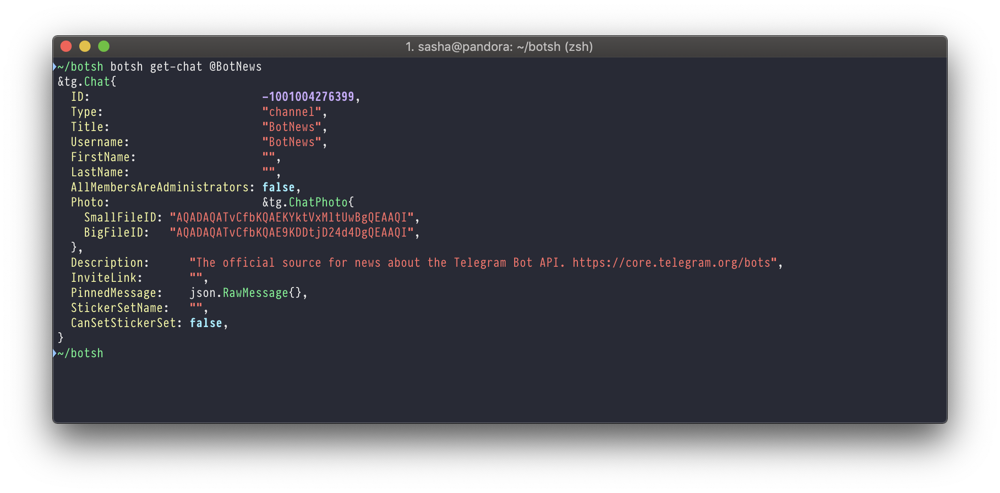
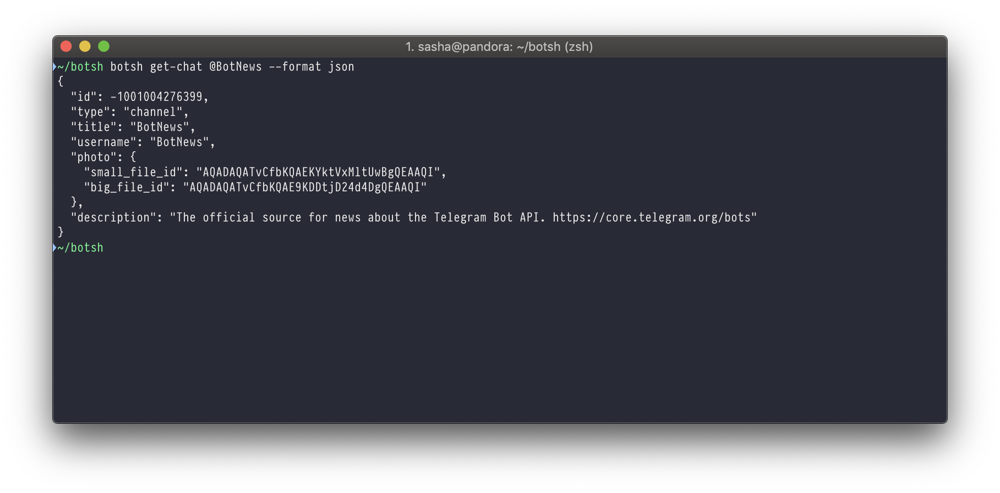
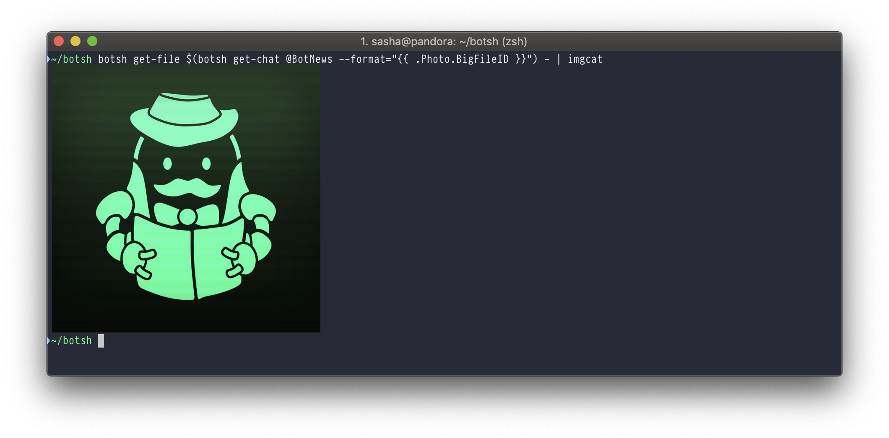

# botsh

Simple Telegram Bot API command-line client

- [botsh](#botsh)
  - [Installation](#installation)
  - [Usage](#usage)
    - [Bot Token](#bot-token)
    - [Output format](#output-format)
      - [Pretty](#pretty)
      - [JSON](#json)
      - [Template](#template)

## Installation

```bash
go get -u github.com/mr-linch/go-tg/examples/botsh
```

## Usage

```
NAME:
   botsh - Simple Telegram Bot API command-line client

USAGE:
   botsh [global options] command [command options] [arguments...]

AUTHOR:
   Sasha Savchuk <mrxlinch@gmail.com>

COMMANDS:
     help, h  Shows a list of commands or help for one command
   chats:
     get-chat, getChat                               get information about chat
     get-chat-administrators, getChatAdministrators  get a list of administrators in a chat
     get-chat-members-count, getChatMembersCount     get a list of administrators in a chat
   generic:
     get-me, getMe       returns basic information about the bot.
     get-file, getFile   get information about chat
     get-updates, getMe  returns basic information about the bot.
   webhook:
     get-webhook-info, getWebhookInfo  get current webhook status.
     set-webhook, setWebhook           use this method to specify a url and receive incoming updates via an outgoing webhook.
     delete-webhook, deleteWebhook     removes current set webhook

GLOBAL OPTIONS:
   --token value            Telegram Bot API token [$TELEGRAM_BOT_TOKEN]
   --request-timeout value  timeout for requests (default: 1m0s)
   --api-domain value       Telegram Bot API domain (default: "api.telegram.org") [$TELEGRAM_BOT_API_DOMAIN]
   --help, -h               show help
```

### Bot Token

There are two ways to specify a token:

```bash

# 1. Environment variable

$ export TELEGRAM_BOT_TOKEN="..."
$ botsh get-me

# 2. Global flag

botsh --token ... get-me

```

### Output format

In commands in which it makes sense, it is possible to specify the output format.
The default format is `pretty`.

#### Pretty




#### JSON



#### Template

This format is useful if you need only some fields from the object.
For example, to pass them as parameters to other commands.

Below is an example of getting the FileID of a channel avatar and displaying it.


